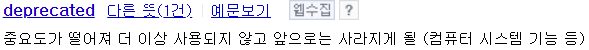

### Etc


## 코틀린 문법 정리

```kotlin
// 변수
var a: Int = 10
a
print(a)
println(a)

// 상수
val AN = "an"
println(AN)

a
a + a

// 함수 선언
fun hihi(str: String) {
    println(str + "ee")
}

hihi("asdfa")

var intA = 10
val longA = 10L
var doubleA = 10.0
val floatA = 10f
var shortA: Short = 10
var byteA: Byte = 10

var stringA = "HiHI"
var charA = 'c'

val longStringA = """HiHi
    I'm hungy
""".trimMargin()

println(longStringA)

stringA = "AAA"
var stringB = "AAA"

// 문자열 값 비교
if (stringA == stringB) { println("same") }
else println("not same")

// 객체 비교 : 상수가 객체화 되기 때문에 if문이 same으로 나온 것.
// class로 동일한 값 넣어놓고 테스트해보면 다름을 객체 비교가 다름을 확인해볼 수 있을까?
a = 20
if (a === 20) { println("same") }
else println("not same")

// 결과 "hiAAABBB AAA hehe"
println("hi${stringA}BBB $stringA hehe")

// 배열 생성
var numbers: Array<Int> = arrayOf(1, 2, 3, 3)
var numbers2: Array<Int> = arrayOf(1, 2, 3, 3)
numbers // [L]java.lang.Integer;@610455d6
numbers2 // [L]java.lang.Integer;@511d50c0

// 출력 : bye. 왜 bye가 출력되는거지??
if(numbers == numbers2) println("hi")
else println("bye")
```
